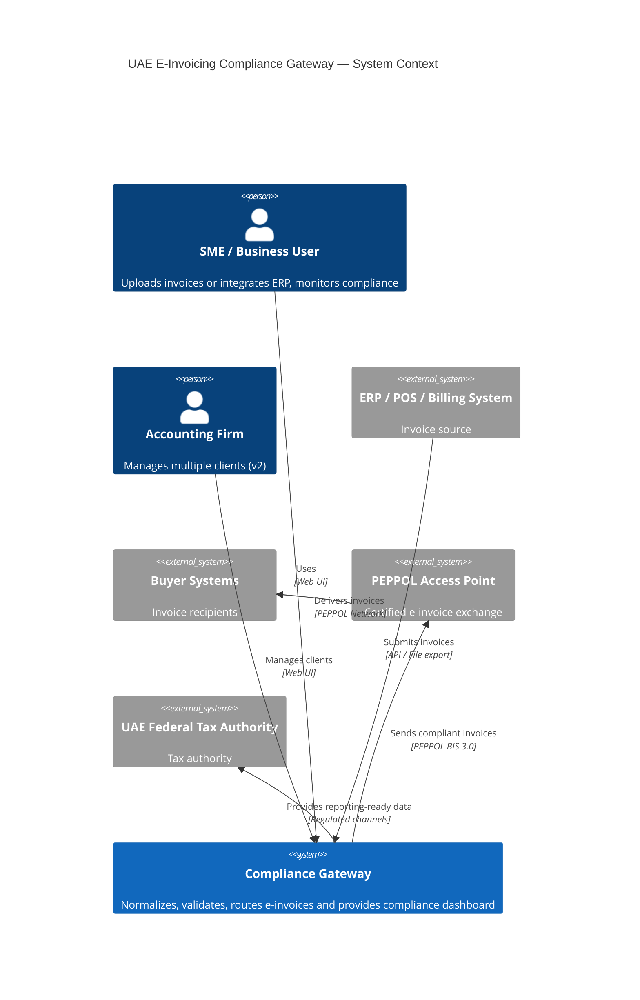
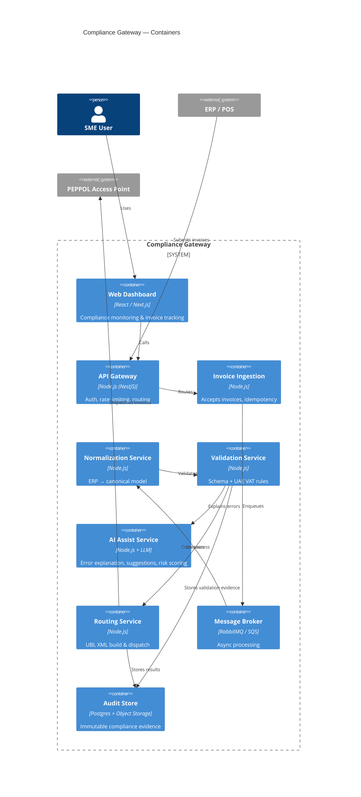
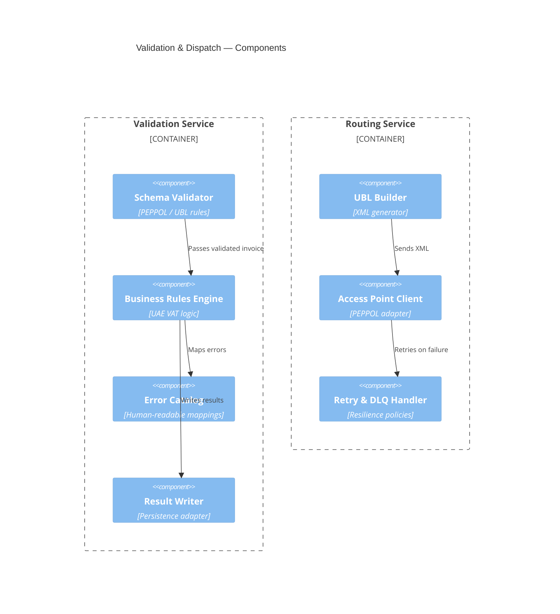

# UAE E-Invoicing Compliance Gateway
## C4 Architecture Pack + Execution Plan

---

## C4 Level 1 — System Context

---

## C4 Level 2 — Container Diagram

---

## C4 Level 3 — Component Diagram (Validation & Dispatch)

---

## Execution Plan

### Phase 0 — Foundation (Start Here)
- Confirm UAE B2B invoice scenarios
- Define canonical invoice schema (v1)
- Select Access Point strategy (mock vs partner)
- Lock tech stack choices
- Create MVP backlog (issue-ready)

### Phase 1 — MVP Build
- Invoice ingestion API + idempotency
- Normalization & validation engines
- UBL XML generation
- Dispatch + retry + DLQ
- Compliance dashboard
- Immutable audit trail

### Phase 2 — AI Enhancements
- Error explanation (human language)
- Auto-fix suggestions
- Risk scoring
- Optional document → invoice extraction

### Phase 3 — Commercial Readiness
- Pricing & plans
- Landing page + demo
- Pilot accounting firm onboarding

### Later Versions
- v2: 🥈 Accountant Dashboard (multi-tenant, white-label)
- v3: 🥉 Plug & Play ERP Connectors

---
